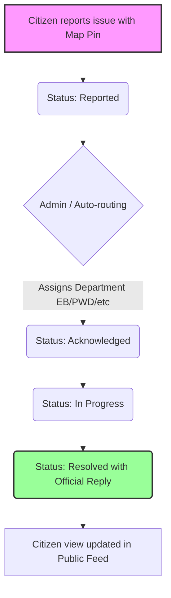

# NammaOorFix 🛠️

**NammaOorFix** is a full-stack, crowdsourced civic issue reporting and resolution portal designed to bridge the gap between everyday citizens and municipal authorities. It turns citizens into active reporters of local problems (such as potholes, garbage piles, and broken streetlights) and provides city officials with a structured, transparent dashboard to track, assign, and resolve these grievances.

---

## 📖 The Big Picture Story

* **For Citizens:** NammaOorFix operates like an "Instagram-style" local civic feed. Citizens can scroll through active issues in their neighborhood, upvote/downvote reports to signal urgency, comment with updates, and submit new issues with descriptions, category, priority, and location pins on an interactive map.
* **For Officers & Admins:** It provides a structured workflow to replace messy manual registers and scattered WhatsApp complaints. Complaints are auto-routed or manually assigned to departments (EB, PWD, Health, Water Supply, etc.), where officials prioritize, update progress, and mark issues as resolved with proof.



---

## 🚀 How It Works

### 👥 For Public Citizens
1. **Report an Issue:** Click "Report Issue", enter details, select a category (Road Damage, Street Light, Garbage, etc.), select priority, and pin the location on the interactive Leaflet/Google Map.
2. **Track Live Progress:** View submitted issues in **My Issues**. Watch the status move from `Reported` ➔ `Acknowledged` ➔ `In Progress` ➔ `Resolved` in real time.
3. **Instagram-Style Feed:** Browse the community feed of active problems in the area. Upvote to bump priority, or read comments from other neighbors facing the same issue.

### 💼 For Officers & Admins
1. **Department Dashboard:** View complaints filtered by assigned department, status, and urgency.
2. **Status Updates:** Update status to `In Progress` or `Resolved` and append official notes (e.g., "Line crew dispatched" or "LED bulb replaced").
3. **Accountability:** Central admins monitor average resolution times, outstanding backlog, and hotspot clusters on a municipal heatmap.

---

## 🛠️ Tech Stack & Architecture

### **Frontend**
* **Framework:** React (v19) with JavaScript
* **Build Tool:** Vite
* **Routing:** React Router DOM (v7)
* **Styling:** TailwindCSS (v4) with `@tailwindcss/vite`
* **Animations:** Framer Motion (for smooth glassmorphism / UI transitions)
* **Maps Integration:** Leaflet, React Leaflet, and Google Maps API
* **Client:** Axios (REST API requests)

### **Backend**
* **Runtime:** Node.js with Express
* **Authentication:** JWT (JSON Web Tokens) & BcryptJS (password hashing)
* **Uploads:** Multer (handling multi-media attachments)
* **Analytics:** `ml-kmeans` (geospatial clustering of complaints)

### **Database**
* **Database:** MongoDB Atlas (Cloud Cluster)
* **ORM:** Mongoose

---

## 💻 Quick Start & Run Commands

### Prerequisites
* Node.js installed
* MongoDB connection URI (or falls back to the default Atlas sandbox cluster)

### Setup Instructions

1. **Install Backend Dependencies**
   ```bash
   cd server
   npm install
   ```

2. **Install Frontend Dependencies**
   ```bash
   cd ../client
   npm install
   ```

3. **Database Seeding (Madurai Master Data & Issues)**
   Seed the database with 100 Madurai wards, citizen accounts, officer profiles, and 15 highly realistic, pre-populated issues across Madurai:
   ```bash
   cd ../server
   node seed_comprehensive.js
   ```

4. **Start Backend API Server**
   ```bash
   node server.js
   ```
   *Runs on [http://localhost:5000](http://localhost:5000)*

5. **Start Frontend Dev Server**
   ```bash
   cd ../client
   npm run dev
   ```
   *Runs on [http://localhost:5173](http://localhost:5173)*

---

## 🛡️ Default Test Credentials
Use these pre-seeded accounts to explore the portal:
* **Citizen User:** `anya@example.com` / `Password123`
* **EB Support Officer:** `eb@nammaoorfix.gov.in` / `Password123`
* **Madurai Corp Officer:** `corp@nammaoorfix.gov.in` / `Password123`
* **System Admin:** `admin@nammaoorfix.gov.in` / `Admin123`
